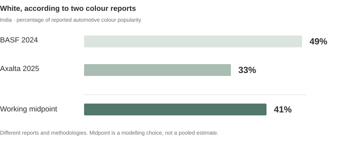
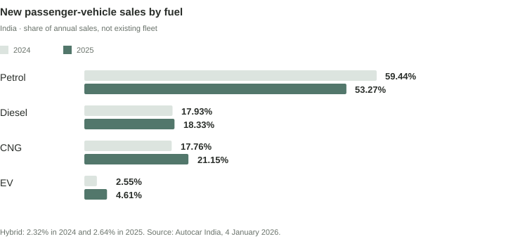

There are white cars everywhere in Bengaluru. But how many of them are actually petrol cars? It sounds like a question that should have a readily available answer. A registration database might know the colour of a car and the fuel it runs on, but a public citywide cross-tab is not easy to find. So, rather than pretend we have that number, let us see how close we can get with a few defensible anchors and some explicit assumptions.

25.2 lakh × 1.05 × 0.65 × 0.41 = 7.05 lakh private cars + 0.43 lakh estimated cabs <strong>≈ 7.5 lakh</strong>

A working estimate, not an official census. The broad scenario range is approximately 5.5 to 10 lakh.

The interesting part is not the multiplication. It is deciding what to multiply, what the numbers mean, and how much uncertainty we are willing to carry. We will begin with registrations, make the missing assumptions visible, address the obvious cab objection, and then approach the question from the household side as a check.

For consistency, white means white alone, not white and silver combined. Petrol means petrol-only cars; petrol-CNG dual-fuel vehicles and hybrids are not deliberately included. The intended universe is Bengaluru's resident passenger-car population, with commercial cabs considered separately. Registered vehicles are a proxy for vehicles in use, not a perfect count of active cars. The geographical boundary is also imperfect because different sources use Bengaluru Urban, the city or broader metropolitan definitions.

## 1. Begin with the strongest anchor

The Karnataka Transport Department figure reported by Business Today puts Bengaluru at **25.2 lakh registered private cars as of 30 June 2026**. This is a better starting point than the older FY2024–25 figure and the extrapolation we initially considered. When a stronger anchor appears, there is little reason to preserve a more elaborate workaround. [1]

We also need to account for cars used in Bengaluru but registered elsewhere. Migration and enforcement of out-of-state vehicle rules establish that this population exists, but they do not tell us its precise share of the fleet. [2] I will therefore allow a **5% uplift**, and test 2% to 8% rather than present the central assumption as measured data.

25.2 lakh registered private cars × 1.05 out-of-state adjustment ≈ 26.46 lakh cars

The uplift is a Fermi assumption. It is not derived from the number of enforcement cases.

## 2. White is surprisingly hard to pin down

Two established automotive-coatings reports give materially different answers. BASF's 2024 India report places white at 49%, while Axalta's 2025 report places it at 33%, including solid and pearl white. Both are useful, but neither is a Bengaluru stock census. Their samples, methodologies and report years differ, so averaging them is a heuristic rather than a statistically weighted estimate. [3, 4]

<figure><figcaption>White share in India: BASF 2024 and Axalta 2025. Recreated from the published reports. The midpoint is a modelling choice, not a pooled statistical estimate. [3, 4]</figcaption></figure>

Rather than choose the figure that makes the answer look prettier, we will use **41% white** as the central assumption and 35% to 48% as a working range. This envelope is judgemental, not a confidence interval. Bengaluru's existing fleet may differ from national new-vehicle colour preferences, and older vintages may have a different mix. The disagreement is useful precisely because it makes that uncertainty visible.

## 3. Petrol: stock is not this year's sales

Autocar India reports that petrol's share of new passenger-vehicle sales fell from 59.44% in 2024 to 53.27% in 2025, while CNG and EVs gained share. [5] But this is a flow of new sales. Our question concerns the stock of cars accumulated over many years, including older vintages purchased when petrol was more prevalent. Applying the latest sales percentage directly to the entire fleet would therefore be a poor shortcut.

<figure><figcaption>India's new passenger-vehicle sales mix, 2024 versus 2025. Recreated from Autocar India's published figures. These are new-sales shares, not Bengaluru's existing fleet mix. [5]</figcaption></figure>

Historical PPAC sales data provides context for older petrol-heavy vintages, but it does not establish today's city stock composition. [6] I will therefore use **65% petrol** for the existing private fleet and test 60% to 70%. This is an assumption, not a measured Bengaluru percentage. A reliable stock extract by vehicle class, fuel and registration year would be the most useful way to improve it.

26.46 lakh × 0.65 petrol × 0.41 white <strong>≈ 7.05 lakh white petrol private cars</strong>

The private-car route before considering commercial cabs.

## 4. What about all those white cabs?

A Bengaluru reader is likely to think of the sea of white and silver taxis. That observation matters, but two effects work in opposite directions. Commercial fleets may favour white, while high-mileage economics have historically favoured diesel and increasingly support CNG or electric alternatives. Local reports of CNG retrofitting support the direction of that argument, not a precise citywide fuel percentage. [7, 8]

A recent report puts registered cabs at about **2.97 lakh**, including independent travel-agency vehicles. [7] The category may include vehicles that are not conventional passenger cars, and the available reporting does not provide a reliable current colour-by-fuel cross-tab. We should say that rather than invent precision.

For a side calculation, assume 55% to 75% of cabs are white and 15% to 30% are petrol-only. At the midpoints:

2.97 lakh cabs × 65% assumed white × 22.5% assumed petrol <strong>≈ 43,000 white petrol cabs</strong>

Both percentages are Fermi assumptions. The implied endpoints are roughly 24,500 and 66,800 vehicles.

The cab adjustment is deliberately separate. The exact current registration-class breakdown and any overlap between the reported private-car and cab categories need confirmation. We are treating them as distinct for the working model, but should not count every registered cab as an ordinary passenger car or pretend the categories are perfectly reconciled.

7.05 lakh private cars + 0.43 lakh estimated cabs = 7.48 lakh <strong>Rounded: about 7.5 lakh</strong>

The private-car endpoints are 5.40 lakh and 9.14 lakh. Adding the illustrative cab endpoints gives approximately 5.64 to 9.81 lakh. I would round that to a broad **5.5–10 lakh working range**. These are scenario bounds, not statistical confidence limits, and the variables may be correlated.

## 5. A second route: households

A useful cross-check should be allowed to disagree. Bengaluru's Comprehensive Mobility Plan household survey reported an average household size of 3.7 and roughly 20% of households with one car. The survey is older and cannot be mechanically projected to 2026, but it provides a starting order of magnitude. [9]

Using a working population of 14.5 million gives approximately 3.9 million households. A 35% car-ownership rate and 1.25 cars per car-owning household imply only about 1.71 million cars, below the registration total. At 45% ownership and 1.4 cars, the result is approximately 2.46 million, close to the registration anchor. The population figure is an approximation informed by contemporary reporting, not an official 2026 census count. [10]

14.5m people ÷ 3.7 ≈ 3.9m households × 45% car-owning households × 1.4 cars per owning household ≈ 2.46m cars

Illustrative ownership assumptions, partly calibrated to the registration anchor.

### Carry the check all the way through

The question is not simply how many cars exist, but how many are both white and petrol. Applying the same fuel and colour filters to the rounded household scenario gives us a second route to the actual target.

2.46m cars × 65% petrol × 41% white <strong>≈ 6.56 lakh white petrol cars</strong>

Using the unrounded household calculation gives approximately 6.58 lakh. Both are the same order of magnitude.

That sits reasonably close to the registration route's 7.05 lakh private-car estimate. If we add the same illustrative cab adjustment, the household route reaches about 7.0 lakh. The comparison is reassuring, but it is **not a second independent confirmation**: both routes reuse the petrol and colour assumptions, and the 45% ownership and 1.4 cars scenario was partly selected to reconcile with the registration total.

A genuinely independent check would require a current, geographically matched estimate of car-owning households and cars per owning household. The 2011 Census ownership data and the older mobility survey are useful historical anchors, but neither establishes the 2026 rate. [9, 11] Differences may also arise from business-owned cars, multiple-car households, cumulative registrations, inactive vehicles and mismatched geographic boundaries.

## 6. What changes the answer?

The value of the model is that we can see which assumptions matter. The table varies the main inputs together. It is a scenario analysis, not a probability model; the low and high cases should not be interpreted as equally likely outcomes.

<table><thead><tr><th>Variable</th><th>Low</th><th>Working</th><th>High</th></tr></thead><tbody><tr><td>Private cars (lakh)</td><td>25.2</td><td>25.2</td><td>25.2</td></tr><tr><td>Out-of-state uplift</td><td>2%</td><td>5%</td><td>8%</td></tr><tr><td>Petrol share</td><td>60%</td><td>65%</td><td>70%</td></tr><tr><td>White share</td><td>35%</td><td>41%</td><td>48%</td></tr><tr><td>Private result (lakh)</td><td>5.40</td><td>7.05</td><td>9.14</td></tr><tr><td>Cab adjustment (lakh)</td><td>0.25</td><td>0.43</td><td>0.67</td></tr><tr><td><strong>Combined (lakh)</strong></td><td><strong>5.64</strong></td><td><strong>7.48</strong></td><td><strong>9.81</strong></td></tr></tbody></table>

The white share and petrol share are the most consequential uncertain filters. Better local stock data would improve the estimate more than adding decimal places to the arithmetic. The next useful research step would be a Bengaluru RTO extract by vehicle class, fuel and registration year, followed by a small observational colour sample. The household route could then serve as a genuinely separate stock check.

<section class="st-notes">

## Author's Notes

All of this is fine, but what is it useful for? Imagine an automotive coatings company developing a treatment to restore the shine of older white cars. How would we estimate its total addressable market (TAM)? I would start with the universe of white cars, then narrow it by age, paint condition, willingness to pay and likely adoption. Yes, I'm aware the smart people are thinking that such a product would apply to all white cars, so why segregate petrol cars in the first place? Fair point. But that would have been a little too straightforward for my curiosity. I wanted a few more variables to play around with. Male ego is more complicated than rocket science, I suppose.

The mathematics is elementary; the exercise is in imagining a question, devising a method to approach it, and turning an intuition into something that can be challenged and improved. We could vary the assumptions, stack a sensitivity analysis on top, and arrive at a most likely, best-case and worst-case estimate. The point is not to claim that we know the exact answer, but to have a reasonable place to start building a theory. It is about thinking outside the box without letting the assumptions become untethered from reality. A little method to the madness, if you will. That is what I have been thinking about recently. Stay tuned to know what I'm thinking right now. See you soon.

</section>

<section class="st-sources">

## Sources and assumptions

The links below identify the published material used in this estimate. Observed figures are distinguished from the author's assumptions. The model is exploratory, not an official vehicle census or a statistically estimated confidence interval.

**[1] Business Today, 20 July 2026.** Karnataka Transport Department figure of 25.2 lakh private cars as of 30 June 2026. [Read the article](https://www.businesstoday.in/amp/auto/story/bengaluru-now-has-over-25-lakh-cars-heres-why-more-residents-are-ditching-public-transport-544058-2026-07-20).

**[2] Times of India, April 2026.** Out-of-state vehicle enforcement; contextual evidence only, not the source of the 5% uplift. [Read the article](https://timesofindia.indiatimes.com/city/bengaluru/in-5-years-taxes-and-penalties-on-out-of-state-vehicles-earned-karnataka-rs-62-4-crore/articleshow/130044951.cms).

**[3] BASF Color Report 2024.** India white share of 49%. Primary report. [Read the PDF](https://www.basf.com/dam/jcr%3Abbbf1760-13ab-4212-a0be-ddb0121442b5/basf/www/cn/documents/en/news-and-media/newsrelease/2025/01/BASF_ColorReport_2024_Final_EN.pdf).

**[4] Axalta Global Automotive Color Popularity Report 2025.** India white share of 33%. Primary report. [Read the PDF](https://www.axalta.com/content/dam/New%20Axalta%20Corporate%20Website/Public/Documents/US/axalta-global-automotive-color-popularity_2025.pdf).

**[5] Autocar India, 4 January 2026.** New passenger-vehicle fuel mix for 2024 and 2025. [Read the article](https://www.autocarindia.com/car-news/only-petrol-car-sales-decline-in-2025-cng-ev-diesel-and-hybrid-see-growth-438722/).

**[6] PPAC Industry Consumption Report, March 2023.** Historical passenger-car and utility-vehicle fuel sales. [Read the PDF](https://ppac.gov.in/uploads/rep_studies/1683086103_ICR_March_2023_%283%29.pdf).

**[7] Times of India, 20 August 2026.** Approximately 2.97 lakh registered cabs, including independent travel agencies. [Read the article](https://timesofindia.indiatimes.com/city/bengaluru/over-2-lakh-cab-drivers-linked-to-bengaluru-aggregators-but-govt-lacks-data-on-locals/articleshow/133385402.cms).

**[8] New Indian Express, 29 April 2024.** CNG retrofitting among conventional-fuel vehicles and travel-industry operators. [Read the article](https://www.newindianexpress.com/amp/story/cities/bengaluru/2024/Apr/29/conventional-fuel-vehicles-opt-to-retrofit-cng-kits).

**[9] Comprehensive Mobility Plan for Bengaluru.** Household survey, average household size of 3.7 and historical car ownership. [Read the PDF](https://data.opencity.in/dataset/f905b8fa-1ee5-4b7d-929b-c9a41f18c2f0/resource/6c25f042-62e3-400a-bab6-f3daa9728991/download/58f2bd6c-2b93-4300-8a14-2929430dcc34.pdf).

**[10] New Indian Express, 5 January 2026.** Reported population of approximately 1.4 crore; contextual anchor for the working population assumption. [Read the article](https://www.newindianexpress.com/amp/story/states/karnataka/2026/Jan/05/government-to-invest-rs-15-lakh-crore-to-improve-bengalurus-infra-dycm-shivakumar).

**[11] Census 2011, Bengaluru household assets.** Historical car/jeep/van ownership data. [Open the dataset](https://data.opencity.in/dataset/bengaluru-census-2011/resource/4efdf9f5-5790-41ca-ac68-13691b31f364).

### Model assumptions

The out-of-state uplift is 2–8% (central 5%); existing private-fleet petrol share 60–70% (65%); white share 35–48% (41%); cab white share 55–75% and petrol share 15–30%; household ownership scenarios 35–45% and 1.25–1.4 cars per owning household. These are not measured Bengaluru percentages. The 14.5 million population is a working approximation, not an official 2026 census count. The numerical outputs are rounded, and the final range is a judgemental scenario envelope rather than a formal probability interval.

</section>
