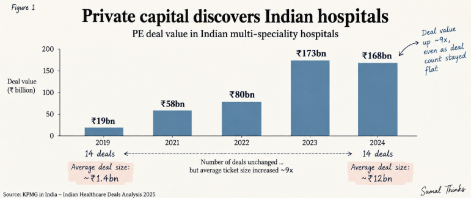
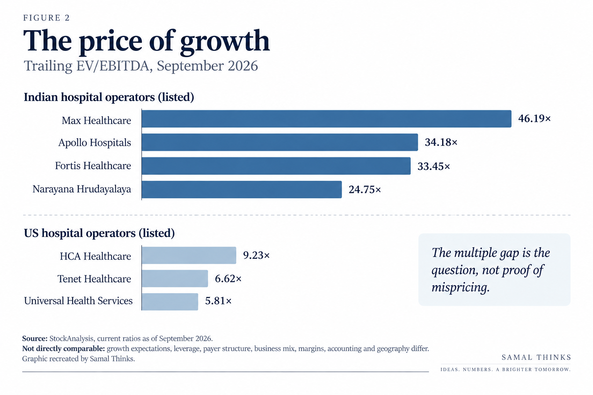
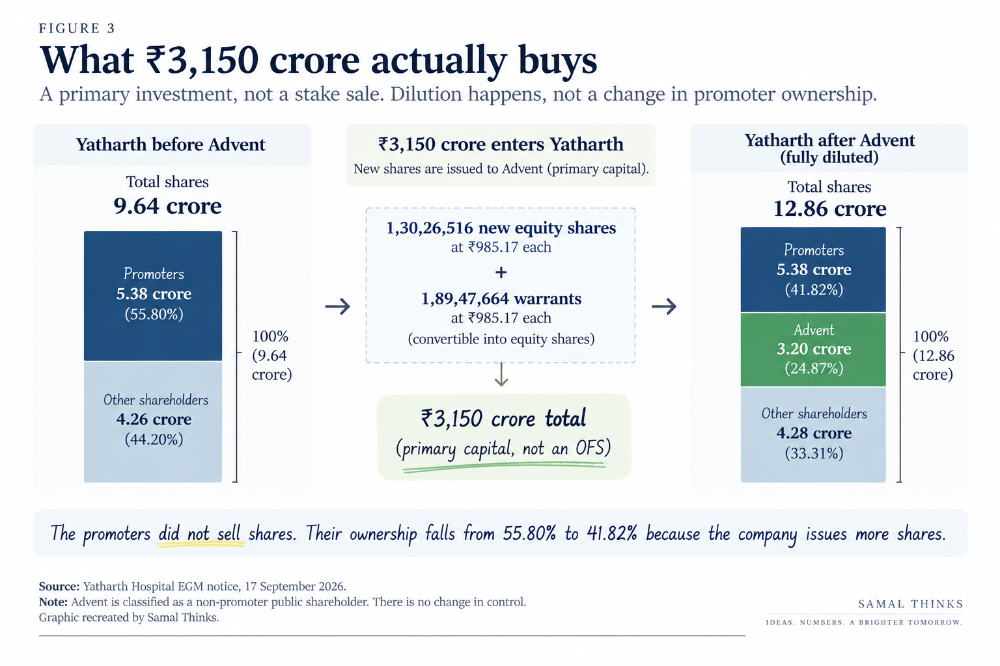
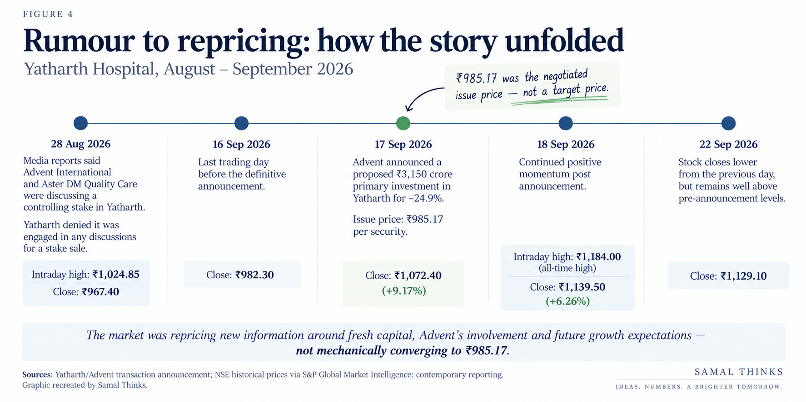

A few weeks ago, if someone had asked me what makes a hospital
attractive to a private equity fund, my answer would probably have been
fairly generic: healthcare demand is growing, hospitals are difficult to
build, and India has a large population.

Then Advent International agreed to invest ₹3,150 crore of primary
capital in Yatharth Hospitals for an expected 24.9% minority stake. **[1][2]**

The number caught my attention. But the more interesting question was
not *why Yatharth?* It was broader:

**Why is global private capital willing to pay increasingly large
valuations for Indian hospital capacity, and what exactly has Advent
agreed to buy for ₹3,150 crore?**

That question took me from hospital beds and medical tourism to
warrants, dilution, voting rights, exit multiples and the slightly
strange mathematics of private equity returns.

This is my attempt to put those pieces together.

## Why does everyone suddenly want Indian hospitals?

Hospitals are unusual businesses.

Demand is not created in quite the same way as it is for a consumer
product. Nobody wakes up hoping to consume more cardiac surgery. Yet the
underlying demand for organised healthcare can expand for decades
because of population growth, ageing, higher incomes, insurance
penetration, chronic disease, greater diagnosis, migration towards
organised providers and simple shortages of quality hospital
infrastructure.

That distinction matters. Rising hospital revenues do not necessarily
mean that society is becoming proportionately sicker. Revenue can also
grow because a patient who previously used an unorganised provider moves
to a large hospital chain, because insurance makes a procedure
affordable, because the hospital adds beds, or because the revenue
earned from each occupied bed rises.

For an investor, that creates an attractive combination: structural
demand and constrained supply.

KPMG estimates India's multi-speciality hospital market at roughly ₹6.3
lakh crore in 2024 and projects it to reach about ₹9.8 lakh crore by
2028, implying growth of around 12% a year. It also points to
consolidation, expansion into tier two and tier three cities, increasing
insurance penetration and growing private equity interest as important
forces reshaping the sector. **[4]**

The capital flowing into hospitals tells its own story. KPMG's deal data
shows private equity deal value rising from roughly ₹19 billion in 2019
to ₹168 billion in 2024. Interestingly, the number of deals was 14 in
both those years. The striking change, therefore, is not merely that
investors are doing more deals. They are writing much larger cheques. **[4]**

*Figure 1. PE deal value in Indian multi-speciality hospitals. Source:
KPMG in India.*

Foreign interest is not new. India permitted 100% foreign direct
investment under the automatic route in hospitals in 2000. NITI Aayog
noted that more than 110 PE and venture-capital investors had entered
India's healthcare-delivery space by 2019. **[5]**

What has changed is the scale.

Large hospital chains are becoming platforms rather than isolated
collections of buildings. Once a chain has a brand, doctors, procurement
systems, referral networks, technology, insurance relationships and
operating processes, each additional hospital can potentially plug into
an existing machine.

That is the part private capital appears increasingly willing to pay
for.

## The strange economics of getting sick

There is another reason India looks unusual from the perspective of
global healthcare capital: the same medical procedure can have radically
different economics depending on where it is performed.

India recorded 507,244 foreign arrivals specifically for medical
treatment in 2025, about 5.5% of total foreign tourist arrivals. In
September 2026, the Government described Indian healthcare costs as
60--80% lower than in many parts of the developed world. **[6][7]**

That advantage can survive even after adding the non-medical costs of
travelling for treatment.

Consider a deliberately simple thought experiment. Historical government
comparisons placed a knee replacement in India at about \$8,500 versus
about \$40,000 in the United States. **[8]** Now make the Indian side less
flattering: add airfare, accommodation and recovery, an attendant's
expenses, local travel and miscellaneous costs. If those additional
costs total \$6,000, the full India trip becomes \$14,500.

That is still only about 36% of the \$40,000 treatment benchmark.

A medical tourism thought experiment

Treatment in India                 $8,500
Return airfare                     $1,500
Hotel and recovery                 $2,000
Attendant (family)                 $1,500
Local travel and misc.             $1,000
                                  ───────
Estimated total                   $14,500

Comparable treatment at home      $40,000

14,500 ÷ 40,000 ≈ 36%

<strong>Even after adding $6,000 around the medical bill, the Indian option costs only about 36% of the alternative.</strong>

This is not an estimate of what an actual patient will spend. Airfares, procedures, accommodation and recovery periods vary enormously. It is simply a sensitivity calculation.

Of course, medical tourism is not a simple price-arbitrage trade.
Patients care about clinical outcomes, accreditation, specialist
availability, waiting periods, language, post-operative care and the
risk of being far from home if complications arise.

But cost differences of this magnitude help explain why Indian tertiary
hospitals can address a market larger than their immediate geography.

This is where the economics become slightly uncomfortable.

A hospital is simultaneously a social institution and a business. For
the patient, admission may represent one of the worst weeks of his or
her life. For the hospital, that same admission is revenue. For an
investor, a rising number of occupied beds can be evidence of operating
leverage.

**The investor sees an expanding market. The patient sees a medical
bill. Both can be true at the same time.**

### The price of growth

That brings us to valuation.

Listed Indian hospital companies have often traded at substantially
higher EBITDA multiples than mature listed hospital operators in the
United States. The comparison is imperfect: growth rates, leverage,
payer mix, margins, accounting, geography and business mix differ
materially.

That is precisely why the comparison is interesting.

*Figure 2. Indicative trailing EV/EBITDA comparison using market data
around September 2026. The businesses are not directly comparable. **[9]***

**The multiple gap is the question, not proof of mispricing.**

A high multiple can be rational if earnings grow into it. A low multiple
can be expensive if earnings deteriorate. The important question is what
future cash flows the market is implicitly asking each business to
produce.

And that takes us to Yatharth.

## What exactly does ₹3,150 crore buy?

On 17 September 2026, Advent International announced that it had entered
into a definitive agreement to invest ₹3,150 crore of **primary
capital** in Yatharth Hospitals. Upon completion, Advent is expected to
hold approximately 24.9%. **[1][2]**

The word *primary* is important.

This is not simply Advent paying Yatharth's promoters ₹3,150 crore and
taking some of their shares. The company itself is issuing new
securities. The money therefore enters Yatharth.

According to the EGM notice, the proposed preferential issue comprises:

-   1,30,26,516 equity shares; and
-   1,89,47,664 warrants, each convertible into one equity share,

at ₹985.17 per security. **[2]**

Together, those securities represent 3,19,74,180 shares on full
conversion.

### Dilution without a promoter sale

Before the preferential issue, Yatharth had 9,63,54,357 shares. Its
promoters held 5,37,62,672 shares, or 55.80%.

The interesting thing is that the promoters do not need to sell a single
share for their percentage ownership to fall.

On the fully diluted post-transaction capital shown in the EGM notice,
total shares become 12,85,56,230, including granted ESOPs. The promoter
holding remains 5,37,62,672 shares, but its percentage falls to 41.82%.
Rasmalai Limited, Advent's investment vehicle, would hold 3,19,74,180
shares, or 24.87%. **[2]**

*Figure 3. Post-issue figures assume full warrant conversion and granted
ESOPs. Source: Yatharth EGM Notice, September 2026.*

This is dilution in its simplest form.

The promoters still own the same number of pieces. There are simply many
more pieces in the pie.

### ₹3,150 crore does not arrive on day one

The shares and warrants also mean the cash arrives in stages.

The equity subscription accounts for roughly ₹1,283.33 crore. For the
warrants, 25% of the consideration is payable upfront, about ₹466.67
crore.

That means approximately ₹1,750 crore comes in initially.

The remaining 75% warrant consideration, roughly ₹1,400 crore, becomes
payable upon exercise of the warrants. **[2]**

₹3,150 crore does not arrive on day one

1. Equity shares
1,30,26,516 shares × ₹985.17
≈ ₹1,283 crore

2. Warrants
1,89,47,664 warrants × ₹985.17
≈ ₹1,867 crore

Only 25% of the warrant consideration is payable upfront.

25% of ₹1,867 crore ≈ ₹467 crore

₹1,283 crore + ₹467 crore
<strong>Initial capital ≈ ₹1,750 crore</strong>

Remaining 75% on warrant exercise
≈ ₹1,400 crore

<strong>Total proposed investment ≈ ₹3,150 crore</strong>

The proposed ₹3,150 crore investment is funded in stages because 75% of the warrant consideration is payable on exercise.

The EGM notice says the company expects approximately ₹2,362.5 crore of
the proceeds to be used for expansion and development of its hospital
network and healthcare infrastructure, expenditure by the company or
subsidiaries, working capital and/or debt repayment. Approximately
₹787.5 crore is earmarked for general corporate purposes. The indicated
deployment period is three years. **[2]**

So the transaction is not merely a change in the shareholder register.
It is also a very large expansion cheque.

### So what is Yatharth being valued at?

At ₹985.17 per security, multiplying the pre-issue share count by the
issue price gives a reference equity value of approximately ₹9,493
crore.

On the fully diluted post-issue share count, the same price implies
roughly ₹12,665 crore.

There is an important caveat here.

₹985.17 should not be read as Advent announcing that its proprietary
discounted-cash-flow model says Yatharth is worth exactly ₹985.17 per
share.

The EGM materials show the pricing references used for the preferential
issue: a 90-trading-day VWAP of ₹870.32, a 10-trading-day VWAP of
₹984.70 and an independent valuer's fair value of ₹900.60. The final
issue price was ₹985.17. **[2]**

It is therefore a negotiated transaction price operating within the
applicable listed-company pricing framework, not a public price target.

### Yatharth has been raising capital for a while

The Advent cheque also makes more sense when seen as part of a sequence.

Yatharth listed in August 2023. Before the IPO it placed 40 lakh shares
at ₹300 each, and its IPO fresh issue comprised 1,63,33,333 shares at
₹300. In December 2024, it returned to the equity market through a QIP
of roughly ₹625 crore at ₹595 per share. **[3]**

The QIP document said part of those proceeds would support acquisitions
including the Model Town hospital opportunity and the Faridabad
transaction.

Now comes a proposed ₹3,150 crore primary infusion.

Seen together, IPO → QIP → Advent looks less like three unrelated
financing events and more like the capital history of a hospital chain
trying to scale quickly.

## But what does Advent actually get?

A 24.87% holding is a minority stake. But percentage ownership alone
does not tell us how much influence an investor has.

The proposed investment documents give Advent a set of negotiated
governance rights.

Subject to the agreed thresholds and terms, Advent can nominate up to
two non-executive directors. It can also nominate one investor director
to the audit committee and one to the nomination and remuneration
committee. The documents provide pre-emptive rights for future issuances
and affirmative-consent rights over specified reserved matters. **[2]**

Those reserved matters are not trivial.

They include, subject to the contractual conditions, matters such as
taking gross debt beyond 0.5× last-twelve-month EBITDA, certain M&A or
expansion outside existing locations above ₹400 crore in a financial
year, certain asset disposals, capital expenditure above ₹300 crore in a
financial year, related-party transactions, schemes and mergers, certain
equity issuances above ₹500 crore and specified capital actions. **[2]**

This is an important distinction in private-equity transactions:

**economic ownership and contractual influence are not the same thing.**

Advent is not proposed to become the promoter and the EGM notice says
there will be no change in control. But a sophisticated minority
investor can still negotiate meaningful protections around decisions
capable of changing the risk or value of its investment.

### Why 24.87%?

The fully diluted disclosed holding is 24.87%, just below 25%.

Under India's takeover framework, 25% is an important threshold because
acquisitions at or above the prescribed level can trigger open-offer
consequences under the SEBI Substantial Acquisition of Shares and
Takeovers Regulations, subject to the detailed rules and exemptions. **[10]**

It is tempting to look at 24.87% and immediately infer motive. I would
not.

The more useful observation is simply that the proposed stake sits
immediately below an important regulatory threshold while still giving
Advent a very substantial economic interest and negotiated governance
rights.

### Do minority shareholders lose their say?

Not in the literal sense. Public shareholders retain their shares and
voting rights.

But the distribution of voting power changes.

On the fully diluted numbers, promoters would hold 41.82% and Advent
24.87%. They are not one voting bloc merely because both are large
shareholders, and Advent is expressly proposed to be classified as a
non-promoter public shareholder. **[2]**

Still, for an ordinary retail investor holding a tiny fraction of the
company, the practical reality is that two sophisticated shareholder
groups will each possess far greater voting and information resources.

That makes the quality of governance protections, independent directors,
disclosure and related-party safeguards more important, not less.

### The unusual 3× clause

The documents contain another feature that deserves attention: the
Upside Share Arrangement between the investor and promoters.

Broadly, if Advent realises returns above specified MoM thresholds on an
exit, part of the incremental economics can be shared with the
promoters. Up to 3× MoM, the disclosed sharing is zero. Between 3× and
3.5×, the promoters participate in 33% of the relevant incremental
profit pool; above 3.5×, the stated share is 20% of the relevant
incremental pool, subject to the detailed contractual mechanics. **[2]**

The company itself states that it bears no cost, liability or dilution
from this arrangement. It is between the investor and promoters and is
subject to the required shareholder approval framework. **[2]**

This does **not** mean Advent expects or promises a 3× return.

But somebody thought 3× was important enough to write into the economics
of the transaction.

Which raises the obvious question.

## And how does Advent eventually make its money?

Private equity is sometimes discussed as though a fund buys a company,
improves it and then simply receives its money back.

That is not how the return works.

For an investment such as Yatharth, the eventual return is likely to
depend primarily on the value at which Advent can monetise its shares,
plus any dividends or other realised distributions along the way.

There are several possible routes.

A future strategic buyer could acquire the stake. Another private equity
fund could buy Advent out. Advent could sell shares through
public-market block trades or gradually reduce its position. The
promoters could potentially participate in a future transaction.
Different routes can also be combined.

Advent has seen this movie before.

It acquired a controlling interest in CARE Hospitals in 2012 for roughly
₹610 crore and sold the business to Abraaj in 2016 in a transaction
reported at around ₹1,300 crore. Other hospital investments in India
have similarly demonstrated the sector's ability to support secondary PE
exits, strategic transactions and public-market monetisation. **[11]**

The broader lesson is that a hospital does not need to be sold as one
indivisible building for a PE investor to exit. A scaled healthcare
platform can become an asset that another financial sponsor, strategic
operator or public market is willing to own.

### What would 3× actually mean?

Start with the simplest possible arithmetic.

Advent invests ₹3,150 crore.

At 2×, the stake is worth ₹6,300 crore.

At 3×, it is worth ₹9,450 crore.

At 4×, it is worth ₹12,600 crore.

If Advent still owned approximately 24.87% when a hypothetical 3× value
was realised, ₹9,450 crore for that stake would correspond mechanically
to a company equity value of roughly ₹38,000 crore.

That is not a forecast.

It is simply the scale of outcome required for a 3× stake value if
ownership were unchanged.

What does Yatharth need to become for 3× to make sense?

₹3,150 crore × 3
= ₹9,450 crore

₹9,450 crore ÷ 24.87%
<strong>≈ ₹38,000 crore implied post-transaction equity value</strong>

The missing variable: time

<strong>Across different holding periods, the annualised return would be:</strong>

<table>
<thead>
<tr>
<th>Exit MoM*</th>
<th>4 years</th>
<th>5 years</th>
<th>7 years</th>
</tr>
</thead>
<tbody>
<tr><td>2.0×</td><td>18.9%</td><td>14.9%</td><td>10.4%</td></tr>
<tr><td>2.5×</td><td>25.7%</td><td>20.1%</td><td>14.0%</td></tr>
<tr><td>3.0×</td><td>31.6%</td><td>24.6%</td><td>17.0%</td></tr>
<tr><td>3.5×</td><td>36.8%</td><td>28.5%</td><td>19.6%</td></tr>
<tr><td>4.0×</td><td>41.4%</td><td>32.0%</td><td>21.9%</td></tr>
</tbody>
</table>

Even the same 3× multiple can mean very different returns depending on the holding period. This is a simplified scenario, not a forecast. <strong>*MoM = Multiple on Money.</strong>

And even 3× tells us surprisingly little until we know *when* it
happens.

A 3× return in four years is approximately a 31.6% annualised return.

In five years, it is about 24.6%.

In seven years, about 17.0%.

The same multiple can therefore represent very different investment
outcomes depending on time.

### How big is Yatharth for Advent?

Advent is not making this investment from a standing start.

The firm reported more than \$109 billion in assets under management as
of 30 June 2026 and more than 55 healthcare investments across 17
countries. The Yatharth investor is backed by Advent's GPE X programme,
whose flagship fund was raised at \$25 billion. **[12]**

At a rough dollar equivalent of about \$329 million, the proposed
Yatharth investment is around 1.3% of \$25 billion.

That is only a mechanical scale comparison. It is **not** the same thing
as saying Yatharth represents 1.3% of Advent's current portfolio NAV or
risk exposure. Fund commitments, deployed capital, realised investments,
reserves, co-investment and portfolio valuation make that calculation
much more complicated.

Still, it helps put the cheque in context.

₹3,150 crore is transformational capital for Yatharth.

For Advent, it is a significant investment inside a very large global
private-equity platform.

### What has to go right?

This is where the story returns from financial engineering to hospital
corridors.

For Advent to make an attractive return, the value of Yatharth
ultimately has to grow.

That can come from adding beds, increasing occupancy, improving revenue
per occupied bed, expanding into new geographies, integrating
acquisitions, improving margins, allocating capital intelligently and
eventually generating much larger cash flows.

Warrants, board rights and exit clauses can shape the investment.

They cannot fill an empty hospital bed.

## What does all this mean for someone buying the listed share?

The public market began processing the Advent story before the
definitive announcement.

On 28 August, reports suggested that Advent and Aster were among parties
interested in a controlling stake. Yatharth subsequently denied that its
promoters were in discussions to sell their stake. **[13]**

On 16 September, immediately before the definitive Advent announcement,
Yatharth closed at ₹982.30.

On 17 September, Advent announced the proposed ₹3,150 crore primary
investment at ₹985.17 per security. **[2]** Yatharth closed at ₹1,072.40.

On 18 September it closed at ₹1,139.50 and traded as high as roughly
₹1,184 intraday. By 22 September it was around ₹1,129.10. **[13]**

*Figure 4. Selected event points around the Advent--Yatharth
announcement. This is an event timeline, not a continuous price chart.*

There is a useful lesson here.

**₹985.17 was not a target price.**

The market price was already close to that level before the definitive
transaction was announced. The subsequent move therefore cannot sensibly
be described as the market simply "catching up" to Advent's price.

What changed was the information set.

Investors now knew that a large global PE fund was prepared to commit
₹3,150 crore of primary capital; that Yatharth would have substantially
more money for expansion; that the investor would receive meaningful
governance rights; and that existing shareholders would be diluted.

Some of those facts can be interpreted positively. Others create new
execution requirements.

The public-market investor therefore has a different question from
Advent.

Advent can negotiate rights, influence major decisions and plan an exit
over several years. A retail shareholder buys the listed security at the
market price available that day.

The question is not:

*Advent paid ₹985.17, so should I pay ₹1,100?*

The better question is:

**How much does Yatharth have to grow before today's ₹985.17 becomes
tomorrow's bargain?**

For me, that means watching a relatively small set of operating numbers:
beds, occupancy, ARPOB, margins and, above all, capital allocation.

Because raising ₹3,150 crore is one thing.

Earning a sufficiently high return on ₹3,150 crore is another.

## Author's Note

What started as me trying to make sense of one ₹3,150 crore deal
eventually became an attempt to understand the larger picture: why
Indian healthcare has become such an attractive destination for capital,
particularly foreign private equity.

As a student of finance, I find the mechanics behind these transactions
equally fascinating. How does someone arrive at a valuation running into
thousands of crores? What exactly is being bought? Why issue shares and
warrants together? What happens to the promoters, existing shareholders
and the money coming into the company? And perhaps most importantly,
what does the investor eventually need the business to become for the
investment to make sense?

The idea behind this piece was therefore not merely to understand the
Advent--Yatharth transaction, but to understand how to read the next
acquisition headline a little better. A large investment, acquisition or
stake sale is rarely just the number mentioned in the headline. Behind
it are valuations, dilution, voting rights, capital allocation,
incentives and, eventually, an exit. For someone participating in the
public markets, those details can often tell a much more interesting
story than the headline itself.

That is what I have been thinking about recently. Stay tuned to know
what I'm thinking right now. See you soon.

------------------------------------------------------------------------

### Transaction status

This article reflects publicly available information as of **23
September 2026**. Advent International and Yatharth Hospitals have
entered into definitive agreements, but the proposed preferential issue
and related arrangements remain subject to shareholder approval,
including the EGM scheduled for 15 October 2026, applicable regulatory
approvals, satisfaction of conditions precedent and closing. Any
prospective shareholding, governance rights or transaction effects
discussed above should be read in that context. **[1][2]**

### Sources & further reading

[1] **Advent International, September 2026.** Announcement of Advent's proposed ₹3,150 crore investment in Yatharth Hospitals for an expected 24.9% stake.  
[Read the announcement.](https://www.adventinternational.com/news/advent-international-to-invest-rs-3150-crore-in-yatharth-hospitals-for-24-9-stake/)

[2] **Yatharth Hospital & Trauma Care Services Limited, EGM Notice, September 2026.** Primary transaction document for the preferential issue, warrants, pricing, use of proceeds, post-issue shareholding, governance rights and Upside Share Arrangement.  
[Read the EGM notice.](https://www.bseindia.com/xml-data/corpfiling/AttachLive/95f2d93b-3bee-4c88-ab94-ef4f506a1241.pdf)

[3] **Yatharth Hospital & Trauma Care Services Limited, QIP Placement Document, December 2024.** Primary document for Yatharth's QIP and the capital-raising history discussed in the article.  
[Read the placement document.](https://www.bseindia.com/corporates/download/12735/QIP%20Open/Placement_Document_20241224003628.pdf)

[4] **KPMG in India, Multi-Speciality Hospitals in India: Evolution of hospital deals post COVID.** Source for the hospital-market estimates and private-equity deal activity discussed in the article and Figure 1.  
[Read the report.](https://kpmg.com/in/en/insights/2025/12/multi-speciality-hospitals-in-india-evolution-of-hospitals-deals-post-covid.html)

[5] **NITI Aayog, Investment Opportunities in India's Healthcare Sector.** Background on foreign investment and private-capital participation in India's healthcare-delivery sector.  
[Read the report.](https://www.niti.gov.in/node/330)

[6] **Press Information Bureau, medical tourism in India.** Government data used for foreign arrivals for medical treatment in 2025.  
[Read the release.](https://www.pib.gov.in/PressReleasePage.aspx?PRID=2257447&lang=1&reg=3)

[7] **Press Information Bureau, September 2026.** Government material on India's healthcare cost advantage and medical value tourism.  
[Read the release.](https://www.pib.gov.in/PressReleasePage.aspx?PRID=2307378&lang=2&reg=48)

[8] **KPMG in India, Heal in India: Catalysing medical and wellness tourism.** Context for the medical-tourism cost comparison and India's medical-value-tourism opportunity.  
[Read the report.](https://kpmg.com/in/en/insights/2025/07/heal-in-india-catalysing-medical-and-wellness-tourism-for-a-healthier-global-future.html)

[9] **Market-data sources, September 2026.** Indicative trailing EV/EBITDA data used for the Indian and US hospital-company comparison in Figure 2. The comparison is illustrative and the businesses are not directly comparable.  
[Explore the market data.](https://stockanalysis.com/)

[10] **SEBI (Substantial Acquisition of Shares and Takeovers) Regulations, 2011, Regulation 3(1).** Regulatory basis for the 25% open-offer threshold discussed in the article.  
[Read the regulations.](https://www.sebi.gov.in/legal/regulations/sep-2011/sebi-substantial-acquisition-of-shares-and-takeovers-regulations-2011-last-amended-on-december-6-2021-_54133.html)

[11] **Moneycontrol, Advent's exit from CARE Hospitals.** Contemporary reporting on Advent's approximately ₹610 crore investment and subsequent sale of CARE Hospitals for around ₹1,300 crore.  
[Read the report.](https://www.moneycontrol.com/news/business/companies/advent-sells-care-hospitals-stake-for-rs-1300-cr-1050589.html)

[12] **Advent International.** Advent's investment-program information and disclosures used for the firm's scale and its $25 billion Global Private Equity X fund.  
[Read about Advent's investment programmes.](https://www.adventinternational.com/investment-strategy/investment-programs/)

[13] **Yatharth exchange clarification and historical market-price data, August–September 2026.** Sources for the pre-announcement rumour/clarification and the selected share-price event points shown in Figure 4.  
[Read Yatharth's clarification.](https://bazaarwatch.com/announcement/95552/yatharth-hospital-trauma-care-services-limited-news-verification)  
[View historical prices.](https://stockanalysis.com/quote/nse/YATHARTH/history/)
*Nothing in this article is investment advice. It is an attempt to
understand the economics and mechanics of a publicly announced
transaction.*

